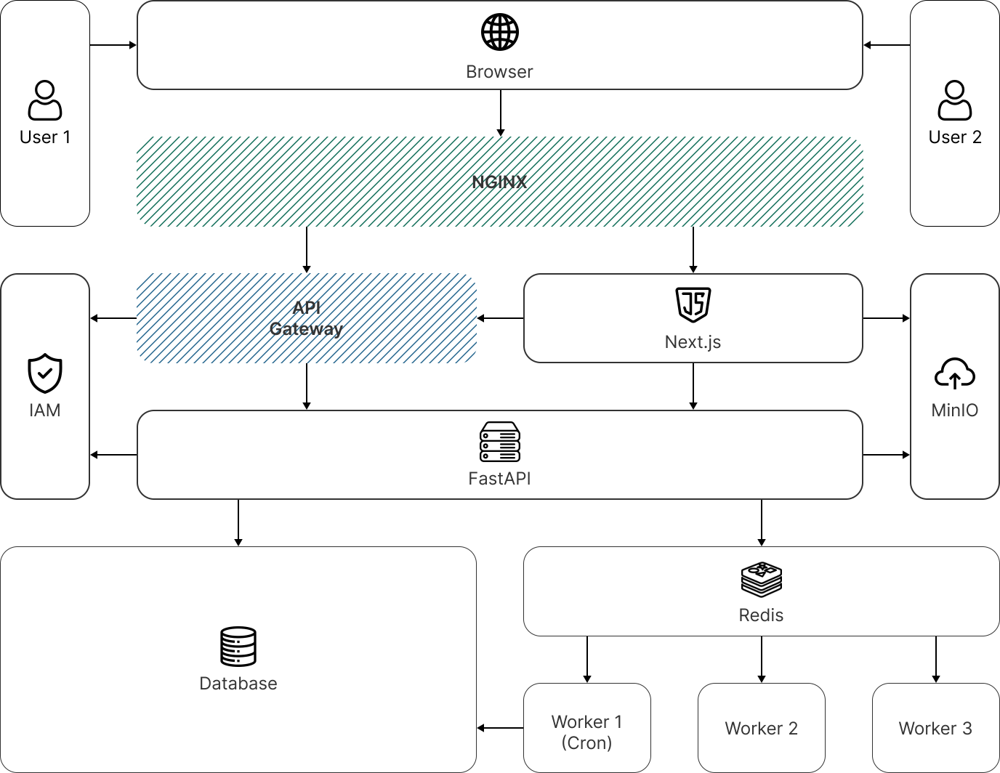

# Altum Market Backend
RESTful B2B агромаркетплейс для автоматизации торгово-закупочных процессов в АПК, реализованный на FastAPI
с применением принципов Domain-Driven Design и Clean Architecture.

## Целевая архитектурная схема
<picture>
  <source media="(prefers-color-scheme: dark)" srcset="docs/assets/architecture-schema-dark.png" width="688">
  
</picture>

Представленная целевая архитектура отражает конфигурацию системы и описывает следующий технический флоу:
Входящий запрос поступает через NGINX, который выступает reverse proxy и терминирует SSL.
Далее запрос маршрутизируется либо на Next.js для рендеринга фронтенда, либо на API Gateway,
который обеспечивает роутинг и авторизацию через IAM. Прошедший проверку запрос передаётся в FastAPI,
где сосредоточена бизнес-логика. Для асинхронных операций FastAPI помещает задачи в Redis,
откуда их подхватывают специализированные воркеры - для отправки email, ресайза изображений и выполнения cron-задач.
Медиафайлы хранятся в MinIO, персистентные данные - в PostgreSQL.

## Быстрый старт
Для удобства управления Docker-окружением проект использует Makefile, который абстрагирует типовые docker-compose
команды в короткие алиасы. Команды Make представлены в таблице ниже.

    Примечание: убедитесь, что на вашей машине установлены Docker и Docker Compose.

| Команда | Описание |
|---------|----------|
| `make up` | Сборка образов и запуск всех сервисов |
| `make build` | Только сборка образов без запуска |
| `make start` | Запуск ранее собранных контейнеров |
| `make stop` | Остановка всех сервисов |
| `make destroy` | Остановка и удаление всех volumes |
| `make logs` | Логи приложения в реальном времени |
| `make restart` | Перезапуск контейнера приложения |
| `make shell` | Bash внутри контейнера приложения |
| `make db` | Подключение к PostgreSQL через psql |
| `make cache` | Подключение к Redis через redis-cli |
| `make ci` | Полный CI пайплайн в изолированном окружении |

### 1. Клонирование репозитория
Склонируйте проект и перейдите в его корневую директорию:
```bash
> git clone https://github.com/altum-kz/altum-market-backend
> cd altum-market-backend
```

### 2. Настройка переменных окружения
Создайте локальные файлы конфигурации на основе предоставленных шаблонов и заполните их вашими секретами/ключами (БД, Redis, интеграции):
```bash
> cp .env.example .env
> cp .env.test.example .env.test
```

### 3. Сборка и запуск инфраструктуры
Запустите автоматическую сборку и старт всех контейнеров (FastAPI, PostgreSQL, Redis, MinIO) одной командой:
```bash
> make up
```
*Примечание: При первом запуске сервис `bloom-init` автоматически сгенерирует необходимые фильтры Блума для медиа-хранилища и завершит свою работу.*

### 4. Документация API и интерактивная песочница
После успешного запуска бэкенд будет доступен локально. Вы можете протестировать эндпоинты через интерактивную документацию:
* **Scalar API Reference:** `http://localhost:8000/scalar`
* **Swagger UI:** `http://localhost:8000/docs`

### 5. Остановка проекта
Для временной остановки контейнеров без потери данных в базе используйте:
```bash
> make stop
```

## Тестирование

Проект покрыт интеграционными и юнит-тестами с использованием `pytest` и `pytest-asyncio`. Все тесты выполняются
в изолированном тестовом контейнере `sut` с использованием выделенной базы данных из конфигурации `.env.test`.

### Комплексная проверка перед коммитом (CI Pipeline)
Перед отправкой кода в удаленный репозиторий рекомендуется запустить полную локальную имитацию CI-пайплайна:
```bash
> make ci
```
*Команда автоматически уничтожит старые тестовые вольюмы, поднимет чистые сервисы (PostgreSQL, Redis, MinIO),
дождется их полной готовности по `healthcheck`, накатит миграции Alembic, прогонит тесты и полностью
ликвидирует за собой окружение, вернув финальный статус-код.*
