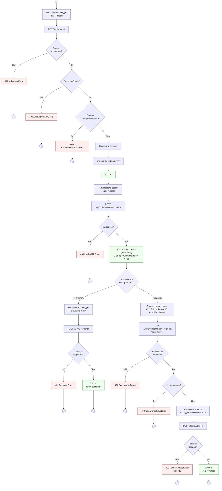

```mermaid
flowchart TD
    Start((" ")) --> U1["Пользователь вводит<br/>email и пароль"]
    U1 --> Reg["POST /api/v1/iam/"]
    Reg --> V1{"Данные<br/>корректны?"}
    V1 -->|Нет| E1["422 Validation Error"]
    V1 -->|Да| V2{"Email свободен?"}
    V2 -->|Нет| E2["409 AccountAlreadyExists"]
    V2 -->|Да| V3{"Пароль<br/>скомпрометирован?"}
    V3 -->|Да| E3["400 CompromisedPassword"]
    V3 -->|Нет| Save["Сохранить аккаунт"]
    Save --> Mail["Отправить код на почту"]
    Mail --> Created["200 OK"]

    Created --> U2["Пользователь вводит<br/>код из письма"]
    U2 --> Otp["POST /api/v1/iam/account/confirm"]
    Otp --> V4{"Код верный?"}
    V4 -->|Нет| E4["400 InvalidOTPCode"]
    V4 -->|Да| Login["200 OK + Set-Cookie<br/>(автологин)<br/>GET /api/v1/iam/me: role = None"]

    Login --> U3{"Пользователь<br/>выбирает роль"}

    U3 -->|Покупатель| U4["Пользователь вводит<br/>фамилию и имя"]
    U4 --> Cust["POST /api/v1/customer/"]
    Cust --> V5{"Данные<br/>корректны?"}
    V5 -->|Нет| E5["422 FullnameError"]
    V5 -->|Да| OkC["200 OK<br/>role = customer"]

    U3 -->|Продавец| U5["Пользователь вводит<br/>ИИН/БИН и форму (IE, LLP, JSC, FARM)"]
    U5 --> Tax["GET /api/v1/vendor/taxpayer/{tax_id}<br/>?legal_form=..."]
    Tax --> V6{"Организация<br/>найдена?"}
    V6 -->|Нет| E6["404 TaxpayerNotFound"]
    V6 -->|Да| V7{"На ликвидации?"}
    V7 -->|Да| E7["400 TaxpayerOnLiquidation"]
    V7 -->|Нет| U6["Пользователь вводит<br/>юр. адрес и ФИО контакта"]
    U6 --> Vend["POST /api/v1/vendor/"]
    Vend --> V8{"Профиль<br/>создан?"}
    V8 -->|Нет| E8["409 VendorAlreadyExists<br/>или 422"]
    V8 -->|Да| OkV["200 OK<br/>role = vendor"]

    E1 --> X1(((" ")))
    E2 --> X2(((" ")))
    E3 --> X3(((" ")))
    E4 --> X4(((" ")))
    E5 --> X5(((" ")))
    E6 --> X6(((" ")))
    E7 --> X7(((" ")))
    E8 --> X10(((" ")))
    OkC --> X8(((" ")))
    OkV --> X9(((" ")))

    classDef user fill:#eef,stroke:#66c,color:#1a1a1a
    classDef err fill:#fee,stroke:#c33, color:#1a1a1a
    classDef ok fill:#efe,stroke:#393,color:#1a1a1a
    class U1,U2,U3,U4,U5,U6 user
    class E1,E2,E3,E4,E5,E6,E7,E8 err
    class Created,Login,OkC,OkV ok
```
